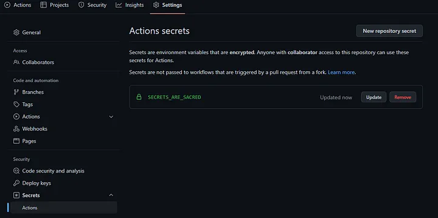
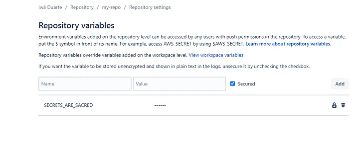

Every now and then someone will come up with new words: DevOps, GitOps, \*.(\*.)Ops, CI/CD, multifactor deployment pods orchestrated in virtual containers (I think I have invented that one).

Thing is, every single developer/team/company wants to achieve a simple objective. Have their files/product/”disruptive technologic” out there for the public to see. It is not always pretty though.

# What is the best way of doing that?

Let me dress my armor, my friend, I will start running from the best practice war before we dive into that topic.

*That is me, running from the war of best practices in my new shining armor. (DALLE-2)*

People are used to mixing the things that they know with the term *best practices*. They learn something through sweat and tears and they hold to it. They hold to it even if there is better tech or way to do it out there, they hold to it because “it gets the job done”. They hold to it because they mastered it.

It is okay. No problem with that. Learning something every second for the sake of learning is just terrible as well. No one should be forced to constantly learn. It is stressful and can get you a lot of headaches.

The real problem is when you try to force on others your limitations or point of view as if they are the “right way of doing something” without a solid reason to do so and without having tried other alternatives and their pitfalls.

For that reason, I want you to step back from your constructions and beliefs and bear with me for a second. If you do not like my suggestion you can always come back and read it again (hahaha) or stick with your position on the matter.

Specifically, in terms of **deploying** something, my opinion is that you should **strive** for **simplicity** and **autonomy**.

# Explaining the way codes are shipped in the most straightforward way

*(You seasoned developer, can skip that part)*

Currently, we have different ways of shipping code but mostly works in that way:

Someone creates a code in their preferred programming language either by creating a new feature, editing existing functionality, or removing something. After that, they save what they did, and nowadays they use [Git](https://en.wikipedia.org/wiki/Git) (VCS).

After **committing** the change, they usually **push** their data to a specific hosted version control system (HVCS) that stores the code for team contribution/sharing. We can name a few:
[GitLab](https://about.gitlab.com/), [GitHub](https://github.com/), [Bitbucket](https://bitbucket.org/product).

There they usually **review** the code and diss the things that they do not like it. Through friendly or toxic comments, undisputed or heavy back-and-forth discussions they get to an agreement and the code can then move forward.

Once the code is approved, it finally gets to the part for which this tutorial was created.

Code is pushed and follows a specific **YAML** file. It contains a set of **rules** and commonly the goal is to connect to a specific ***cloud service***, set arbitraries ***environment variables***, and send the ***code*** their way.

That is what the **YAML** is for. Securely send data to a specific cloud service ( [AWS](https://aws.amazon.com/), [Google Cloud](https://cloud.google.com/), [Azure](https://azure.microsoft.com/en-us/) ). They call the whole process, CI/CD, deployment, etc etc etc. (*Hey picky, I know they are not the same, but they kind of are.*)

*The picky guy staring at me and shaking his head (DALLE-2)*

If we could establish the steps of these files would be something like that:

1. To connect and send data to the cloud service.

1. *Sometimes* to do some testing and check some linting rules

1. To create the container image (as the container read it, a file with directives of what this “*mini-computer*” should have installed and configurations) or bundle or whatever it needs to be transformed.

1. To set up environment variables.

These 4 steps are not mandatory and by no means exhaustive either. They could appear isolated or in conjunction with the others. By looking at this you could think: “This should be straightforward work”.

And yet people manage to make this **YAML** file even more complex than needs to be.

# The problem with too complex configuration files

Let me start with examples, I will show you a few different files that are way too complex and a few that should be simple enough.

### Show me the DAMN CODE!

*Sorry. It is my second post, I am striving for quality. :P*

This below would be one of the complex ones that could be simplified. *(It is tricky because **it looks** simple)*

```
image: someimage
pipelines:
  branches:
    master:
      - step:
          name: Deploy to Prod 
          #deployment: production
          script:
            - export AWS_ROLE="XXXXXXXXXXXXXXXX"
            - export AWS_ACCOUNT_NAME="XXXXXXXXXXXXXXXXXX"
            - export AWS_ACCOUNT_ID="XXXXXXXXXXXXXXXXXXXX"
            - export ENV="prod"
            - export timeStamp=$(date +%s)
            - export DBHOST=YYYYYYYYYYYYYYYYYYYYYYYYYYYYYYYYYY
            - export LAMBDA_FN=YYYYYYYYYYYYYY
            - make deploy

```

I know you probably are wondering. What is the problem with that code and what does it do?

**Make yourself this question**. What is this configuration is intending to do? Remember my young Padawan, *“send some code to someplace”*.

Could you with that file alone see exactly what is going on here? See where is going? See which service is being called? Let me spoil for you, **no you can not**. They are using [MAKE](https://www.gnu.org/software/make/), motherf*** [MAKE](https://www.gnu.org/software/make/). That is insane!

I will show you ***partially*** what the command: make deploy is doing

```
ifdef DOTENV
   DOTENV_TARGET=dotenv
else
   DOTENV_TARGET=.env
endif

ifdef AWS_ROLE
  ASSUME_REQUIRED?=assumeRole
endif

################

deploy: $(ENV_RM_REQUIRED) $(DOTENV_TARGET) $(ASSUME_REQUIRED)
   docker-compose run --rm serverless make _deps _buildLayer _deploy


# Create .env based on .env.template if .env does not exist
.env: XXXXXXXX

# Create/Overwrite .env with $(DOTENV)
dotenv: YYYYYYYYYYYY

_deps:
   echo "//registry.npmjs.org/:_authToken=$(NPM_TOKEN)" >> .npmrc
   yarn config set registry http://registry.npmjs.org
   yarn install --no-bin-links

_buildLayer:
   mkdir -p folder
   mv database folder
   mv node_modules folder
   echo 'folder'
   ls ./folder

_deploy:
   sls deploy --force -v
```

Could you make a guess what are they trying to do now? I will facilitate it for you:

1 — Create env variables 

2 — Set registry for private package usage

3 — Deploy using the serverless framework (**sls deploy**)

4 —Setting everything through a docker container

Serverless here is another beast and goes out of the scope of this tutorial. What I wanna show you is that they used MAKE to create the same things that you could achieve with the YAML file alone.

### **But why did they do it?**

The rationale behind this is to avoid [**vendor locking**](https://en.wikipedia.org/wiki/Vendor_lock-in) and to be **[agnostic-ready](https://en.wikipedia.org/wiki/Agnostic_(data))**. If they wanna move from **Bitbucket** to **GitLab** to **GitWhatever** they would do it and the code would stay pretty much the same.

These kinds of rationales are in my view overzealous. They show your ego side more than anything else. Yep, you know how to create performant pipelines with MAKE, you know your bits. You are competent. But still, you lack the simplification. The dumb-down approach that everyone is asking for.

They are also too concerned with vendor locking. One way or another we are going to be vendor locked at something. Does not matter. Either AWS or Azure, GitLab or Git, *Java or Node.js*. Therefore, trying to predict the future is not a great strategy in my books.

>> It is worth noting that although programming languages are not vendors if you think indirectly they are. They are the first architectural decision that will base all your choices afterward.

The agnostic approach or silver bullet approach which is worrying about changing lines of code in the future is not effective as well. How many times did you change your well-planned architecture? If everything runs well and you are not facing some significant cost/performance/errors issues you are probably giving that system a **stamp** of the *legacy system to be*.

Changing and breaking things are crucial parts of any human cycle. Do not be too concerned too soon. Wait until you get the problem… Capisci?

### How I would change that for simplicity?

```
image: someimage
pipelines:
  branches:
    master:
      - step:
          name: Deploy to Prod 
          #deployment: production
          script:
            - export AWS_ROLE="XXXXXXXXXXXXXXXX"
            - export AWS_ACCOUNT_NAME="XXXXXXXXXXXXXXXXXX"
            - export AWS_ACCOUNT_ID="XXXXXXXXXXXXXXXXXXXX"
            - export ENV="prod"
            - export timeStamp=$(date +%s)
            - export DBHOST=YYYYYYYYYYYYYYYYYYYYYYYYYYYYYYYYYY
            - export LAMBDA_FN=YYYYYYYYYYYYYY
            - npm install
            - npm install serverless -g
            - sls deploy --force -v
```

You can now look at that file and see exactly what is going to do. You do not need to iterate through thousands of files to get the gist of what is going on.
It is **easier**, it is **simpler** and it is **straightforward**.

And with that comes the first suggestion. Try to put the **minimum number of files out there**. In case you have 100000 lines of YAML file. Okay. You deserve a better organization but instead of organizing first assuming that your configuration will grow, embrace the chaos and let run wild for a while. You can thank me later.

# The problem with environment variables

### Where to put my .env variables?

> Firstly, what is env variables ? You can check this article [https://www.freecodecamp.org/news/what-are-environment-variables-and-how-can-i-use-them-with-gatsby-and-netlify/](https://www.freecodecamp.org/news/what-are-environment-variables-and-how-can-i-use-them-with-gatsby-and-netlify/) (you can skip the gatsby and netlify part)

Another current problem is related to where to store environment variables. People waste too many times arguing about where should be the safest place out there and they ended up doing the silliest things ever.

I have seen companies store their environment variables in a database. Seriously.***IN A DATABASE***, in a **TABLE**, plain **ENGLISH,** and contained every single token/PWD/user to every service used inside their application. Please, do not do this. There is no rationale behind it, sometimes we do not know any better.

The most common place is to use a file .**env**. It has led to problems like people committing their [credentials to public repositories](https://www.ndss-symposium.org/wp-content/uploads/2019/02/ndss2019_04B-3_Meli_paper.pdf).

Another way is to store the credentials in a **secrets manager** in the cloud. 
From there your application asynchronously would request the credential when needed. For using ou would need to use their SDK. Here goes a simple example.

https://stackoverflow.com/questions/57618689/how-do-i-use-aws-secret-manager-with-nodejs-lambda/57618800#57618800

For more info, you can check this: [using AWS SSM](https://docs.aws.amazon.com/systems-manager/latest/userguide/systems-manager-parameter-store.html).

Both of the solutions are fine. If you have configured your .env variables correctly they will be a strong candidate. The simplest, easiest, laziest way that I can think of is to combine .env files and the hosted version control system feature that allows saving encrypted secrets to be used in the deployment phase.

GitHub calls it **Action secrets**, Bitbucket calls it **Repository variables.** If done right that will suffice for 90% of the cases.

For GitHub you would go for that link:
[https://github.com/your-username/your-repository/settings/secrets/actions](https://github.com/iwaduarte/my-finances/settings/secrets/actions)

*You can see that environment variables are encrypted as described in the image. (GitHub settings)*

For Bitbucket you would have:
[https://bitbucket.org/your-username/your-repo/admin/addon/admin/pipelines/repository-variables](https://bitbucket.org/iwaduarte/my-repo/admin/addon/admin/pipelines/repository-variables)

*In Bitbucket you can encrypt or not. Your choice.*

And then you would configure your file as follows:

**Bitbucket YAML:**

```
pipelines:
  branches:
    master:
      - step:
          name: Test and deploy to dev
          image: node:16
          caches:
            - node
          deployment: test
          script:
            - npm install
            - npm install serverless -g
             - serverless config credentials --provider aws --key $AWS_KEY --secret $AWS_SECRET
            - touch .env
            - echo "DB_NAME=$DB_NAME" >> .env
            - echo "DB_USER=$DB_USER" >> .env
            - echo "DB_DIALECT=$DB_DIALECT" >> .env
            - echo "DB_PASS=$DEV_DB_PASS" >> .env
            - echo "DB_HOST=$DEV_DB_HOST" >> .env
            - serverless deploy
          artifacts:
            - dist/**
```

*Explained steps:*  
1— The variables $AWS_KEY and $AWS_SECRET are set in the **repository variables** section (as explained above) and they are important to the serverless framework.

2— Then we create a file .env with the command **.touch env** and we start populating the secrets/variable in it (i.e “DB_NAME=$DB_NAME” >> .env )

3 — This .env file will be sent with other files to the selected destination (in that case they will send environment variables to [AWS lambda](https://aws.amazon.com/lambda/))

**GitHub YAML:**

```
name: Deploy to Fargate
on:
  push:
    branches:
      - master
jobs:
  deploy:
    name: Deploy Node to ECS Fargate
    runs-on: ubuntu-latest
    strategy:
      matrix:
        node-version: [16.x]
    steps:
      - uses: actions/checkout@v2
      - uses: actions/setup-node@v2-beta
        with:
          node-version: '16'
      - name: Install dependencies
        run: npm install

      - name: Set env variables
        run: |
          touch .env
          echo "NODE_ENV=stage" >> $GITHUB_ENV
          echo "SERVICE_NAME=${{ secrets.SERVICE_NAME_PROD }}" >> $GITHUB_ENV
          echo "AWS_ACCESS_KEY=${{ secrets.AWS_ACCESS_KEY_ID}}" >> .env
          echo "AWS_SECRET_ACCESS=${{ secrets.AWS_SECRET_ACCESS_KEY}}" >> .env
          echo "DATABASE=${{ secrets.DATABASE}}" >> .env
          echo "DATABASE_HOST=${{ secrets.DATABASE_HOST}}" >> .env
          echo "DATABASE_USER=${{ secrets.DATABASE_USER}}" >> .env
          echo "DATABASE_PASSWORD=${{ secrets.DATABASE_PASSWORD}}" >> .env

      - name: Configure AWS credentials
        uses: aws-actions/configure-aws-credentials@v1
        with:
          aws-access-key-id: ${{ secrets.AWS_ACCESS_KEY }}
          aws-secret-access-key: ${{ secrets.AWS_SECRET_ACCESS_KEY}}
          aws-region: ${{ secrets.AWS_REGION_ECS }}
      - name: Login to Amazon ECR
        id: login-ecr
        uses: aws-actions/amazon-ecr-login@v1

      - name: Build, tag, and push image to Amazon ECR
        id: build-image
        env:
          ECR_REGISTRY: ${{ steps.login-ecr.outputs.registry }}
          ECR_REPOSITORY: ${{ secrets.ECR_REPOSITORY }}
          IMAGE_TAG: ${{ env.NODE_ENV }}-latest
        run: |
          # Build a docker container and
          # push it to ECR so that it can
          # be deployed to ECS.
          docker build -t $ECR_REGISTRY/$ECR_REPOSITORY:$IMAGE_TAG .
          docker push $ECR_REGISTRY/$ECR_REPOSITORY:$IMAGE_TAG
          echo "::set-output name=image::$ECR_REGISTRY/$ECR_REPOSITORY:$IMAGE_TAG"

      - name: Fill in the new image ID in the Amazon ECS task definition
        id: task-def
        uses: aws-actions/amazon-ecs-render-task-definition@v1
        with:
          task-definition: ecs-task-definition-${{ env.NODE_ENV }}.json
          container-name: container-name
          image: ${{ steps.build-image.outputs.image }}

      - name: Deploy Amazon ECS task definition
        uses: aws-actions/amazon-ecs-deploy-task-definition@v1
        with:
          task-definition: ${{ steps.task-def.outputs.task-definition }}
          service: ${{ env.SERVICE_NAME }}
          cluster: ${{ secrets.ECS_CLUSTER_NAME }}
          wait-for-service-stability: true

      - name: Configure AWS credentials
        uses: aws-actions/configure-aws-credentials@v1
        with:
          aws-access-key-id: ${{ secrets.AWS_ACCESS_KEY }}
          aws-secret-access-key: ${{ secrets.AWS_SECRET_ACCESS }}
          aws-region: ${{ secrets.AWS_REGION }}
```

*Explained steps:*

1 — This is a little more convoluted example. It sends data to a service called [Fargate](https://aws.amazon.com/fargate/getting-started/?nc=sn&loc=3) through a series of **GitHub actions** from other repositories (official AWS ones)

2 — It needs the environment variables that were set in the repository in **Action secrets** (above).

3 — It creates the .env file that will be saved inside that image that will run on Fargate

4 — Not only uses the environment variables for creating the .env file but to connect to AWS services.

This is a way more complex YAML file with several steps and configurations and yet it uses one file. If you read carefully you can see what is going to do, it uses the secrets from the VCS service and sends the code to the Fargate service.

**Straightforward, boring even.** And if you know a little about YAML configuration, you would say: “**simple** to follow”. However, if you do not know what is all this jargon, fear not.

They have provided beautiful documentation:

[**GitHub — Understanding GitHub actions**](https://docs.github.com/en/actions/learn-github-actions/understanding-github-actions)  
[**BitBucket — Configure bitbucket-pipelines.yml (same as YAML)**](https://support.atlassian.com/bitbucket-cloud/docs/configure-bitbucket-pipelinesyml/)

In the last part of this tutorial let’s discuss when you have different branches and similar code for them.

# The problem with having different branches and similar behavior

### Run actions on specific branches

For BitBucket, branches are part of the configuration, so you can set the specific branch and the configuration will run exclusively. That feature is **very important (kudos to the Atlassian team)** because you can have a separate development branch and production in the same config file. Something like:

```
pipelines:
  default:
    - step:
        name: Build and test
        script:
          - npm install
          - npm test
  branches:
    master:
    - step:
          name: deploy  to PRODUCTION
          image: node:16
          caches:
            - node
          deployment: test
          script:
            - npm install
            - npm install serverless -g
            - serverless config credentials --provider aws --key $AWS_KEY --secret $AWS_SECRET
            - touch .env
            - echo "DB_NAME=$DB_NAME_PROD" >> .env
            - echo "DB_USER=$DB_USER_PROD" >> .env
            - echo "DB_DIALECT=$DB_DIALECT_PROD" >> .env
            - echo "DB_PASS=$DEV_DB_PASS_PROD" >> .env
            - echo "DB_HOST=$DEV_DB_HOST_PROD" >> .env
            - serverless deploy
          artifacts:
            - dist/**
    develop:
      - step:
          name: deploy to DEVELOP
          image: node:16
          caches:
            - node
          deployment: test
          script:
            - npm install
            - npm install serverless -g
            - serverless config credentials --provider aws --key $AWS_KEY --secret $AWS_SECRET
            - touch .env
            - echo "DB_NAME=$DB_NAME_DEV" >> .env
            - echo "DB_USER=$DB_USER_DEV" >> .env
            - echo "DB_DIALECT=$DB_DIALECT_DEV" >> .env
            - echo "DB_PASS=$DEV_DB_PASS_DEV" >> .env
            - echo "DB_HOST=$DEV_DB_HOST_DEV" >> .env
            - serverless deploy
          artifacts:
            - dist/**
```

In that case, if you push an application to the master branch only the master gets updated, and development is skipped. Pretty neat huh?

## How about GitHub?
I do not know why it is different. Many times in my journey I did not like how they made things and everything seemed more complicated. As you know by now I have aversion to cleverness when brings more stuff for me to learn/work.

Some of the tutorials that I have read before coming up with my (rant) one are pretty good, except when it comes to branches:
[https://keithweaverca.medium.com/only-run-github-actions-on-specific-branches-694782fcc07](https://keithweaverca.medium.com/only-run-github-actions-on-specific-branches-694782fcc07)

[https://medium.com/sysf/how-to-set-up-github-workflows-and-create-github-actions-using-docker-3a5ba7ec0988](https://medium.com/sysf/how-to-set-up-github-workflows-and-create-github-actions-using-docker-3a5ba7ec0988)

They have the same strategy. If you create a branch you create a different file.And “new branch — new YAML” paradigm it goes against what I have defended here so far, do you remember my young Padawan?

>> “Try to put the **minimum number of files out there**.”

And with that and the help of the best place to copypasta code:

https://stackoverflow.com/a/58142412/7350853

After reading that you can see the solution. We could now come up with a better version. Using if’s. Simple if’s. Well known by every developer that has touched a surface of a keyboard. Great. Let’s do this.

Reusing the same Fargate YAML file:

```
name: Deploy to Fargate
on:
  push:
    branches:
      - master
jobs:
  deploy:
    name: Deploy Node to ECS Fargate
    runs-on: ubuntu-latest
    strategy:
      matrix:
        node-version: [16.x]
    steps:
      - uses: actions/checkout@v2
      - uses: actions/setup-node@v2-beta
        with:
          node-version: '16'
      - name: Install dependencies
        run: npm install

      - name: Set env variables for DEVELOP
      if: github.ref == 'refs/heads/develop'
        run: |
          touch .env
          echo "NODE_ENV=dev" >> $GITHUB_ENV
          echo "SERVICE_NAME=${{ secrets.SERVICE_NAME_DEV }}" >> $GITHUB_ENV
          echo "AWS_ACCESS_KEY=${{ secrets.AWS_ACCESS_KEY_ID}}" >> .env
          echo "AWS_SECRET_ACCESS=${{ secrets.AWS_SECRET_ACCESS_KEY}}" >> .env
          echo "DATABASE=${{ secrets.DATABASE_DEV}}" >> .env
          echo "DATABASE_HOST=${{ secrets.DATABASE_HOST_DEV}}" >> .env
          echo "DATABASE_USER=${{ secrets.DATABASE_USER_DEV}}" >> .env
          echo "DATABASE_PASSWORD=${{ secrets.DATABASE_PASSWORD_DEV}}" >> .env
      - name: Set env variables for PRODUCTION
      if: github.ref == 'refs/heads/master'
        run: |
          touch .env
          echo "NODE_ENV=dev" >> $GITHUB_ENV
          echo "SERVICE_NAME=${{ secrets.SERVICE_NAME_PROD }}" >> $GITHUB_ENV
          echo "AWS_ACCESS_KEY=${{ secrets.AWS_ACCESS_KEY_ID}}" >> .env
          echo "AWS_SECRET_ACCESS=${{ secrets.AWS_SECRET_ACCESS_KEY}}" >> .env
          echo "DATABASE=${{ secrets.DATABASE_DEV}}" >> .env
          echo "DATABASE_HOST=${{ secrets.DATABASE_HOST_PROD}}" >> .env
          echo "DATABASE_USER=${{ secrets.DATABASE_USER_PROD}}" >> .env
          echo "DATABASE_PASSWORD=${{ secrets.DATABASE_PASSWORD_PROD}}" >> .env
      - name: Configure AWS credentials
        uses: aws-actions/configure-aws-credentials@v1
        with:
          aws-access-key-id: ${{ secrets.AWS_ACCESS_KEY }}
          aws-secret-access-key: ${{ secrets.AWS_SECRET_ACCESS_KEY}}
          aws-region: ${{ secrets.AWS_REGION_ECS }}
      - name: Login to Amazon ECR
        id: login-ecr
        uses: aws-actions/amazon-ecr-login@v1

      - name: Build, tag, and push image to Amazon ECR
        id: build-image
        env:
          ECR_REGISTRY: ${{ steps.login-ecr.outputs.registry }}
          ECR_REPOSITORY: ${{ secrets.ECR_REPOSITORY }}
          IMAGE_TAG: ${{ env.NODE_ENV }}-latest
        run: |
          # Build a docker container and
          # push it to ECR so that it can
          # be deployed to ECS.
          docker build -t $ECR_REGISTRY/$ECR_REPOSITORY:$IMAGE_TAG .
          docker push $ECR_REGISTRY/$ECR_REPOSITORY:$IMAGE_TAG
          echo "::set-output name=image::$ECR_REGISTRY/$ECR_REPOSITORY:$IMAGE_TAG"

      - name: Fill in the new image ID in the Amazon ECS task definition
        id: task-def
        uses: aws-actions/amazon-ecs-render-task-definition@v1
        with:
          task-definition: ecs-task-definition-${{ env.NODE_ENV }}.json
          container-name: container-name
          image: ${{ steps.build-image.outputs.image }}

      - name: Deploy Amazon ECS task definition
        uses: aws-actions/amazon-ecs-deploy-task-definition@v1
        with:
          task-definition: ${{ steps.task-def.outputs.task-definition }}
          service: ${{ env.SERVICE_NAME }}
          cluster: ${{ secrets.ECS_CLUSTER_NAME }}
          wait-for-service-stability: true

      - name: Configure AWS credentials
        uses: aws-actions/configure-aws-credentials@v1
        with:
          aws-access-key-id: ${{ secrets.AWS_ACCESS_KEY }}
          aws-secret-access-key: ${{ secrets.AWS_SECRET_ACCESS }}
          aws-region: ${{ secrets.AWS_REGION }}
```

As you can easily see, using the IF clause ( if: github.ref == ‘branch' ) we have set the **Actions secrets** for production and the **Action secrets** for development and they will only populate the .env file when the specific branch is committed.

That is the stupidest way ever and I am proud. It is so straightforward that you will not need MAKE or thousands of files or anything else. Just a little bit of if’s here and there, a few env variables set and there you go you are mastering the way of becoming a **Jedi of KISS**.

*KISS (Keep it simple, stupid) (DALLE-2)*

It is worth noting, that I know, the world is full of complicated cases and specific scenarios that would need some level of complexity. Most of your rationale defending your idea can indeed be the only and only solution. I will not dispute that, there are complex cases that I as a blub programmer will not even conceive in my limited perception/knowledge.

And that is fine. I am aiming at the ones that do not have a clue of what they are doing or did not stop to think a little bit if that would bring joy a few weeks later when everyone forgets what they did.

I am defending simplicity and autonomy. I could go and show several other cases and problematic approaches but I guess that I have delivered the message of how to be utmost sophisticated.

**Finally** you can face them my young one. Without any hesitation or fear.

*My padawan is starting to believe. (DALLE-2)*

Good luck with your journey!


