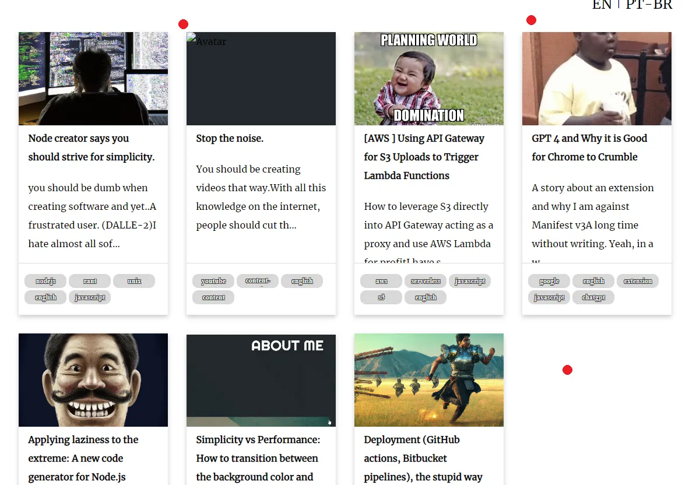

---
url:
canonical_url: https://iwaduarte.dev/blog/en/08-creating-a-blog
title: Creating a blog. A complete guide to move towards madness.
subtitle: How to use Astro, Markdown, mdx, React and a bunch of other tools
description: "A complete guide on how to migrate from Medium, use Astro framework and cross-posting for profit"
tags:
  - astro
  - blog
  - markdown
  - react

author: Iwá Duarte

layout: ../../../layouts/blog.astro
date: "Sep 20 2023"
duration: "15 min read"
image: /assets/chilling.webp
language: english
slug: /blog/en/08-creating-a-blog
---


### I was chilling...

*That it is not me, but indeed is chilling on this paradisaical island (DALLE-2).*

When I started creating my site, I had in mind two things:

1. I needed to show that I was capable of delivering good code and that I understood things at a high level ("senior").
2. It had to be easy to develop the website, thus I could focus on coding, articles, and features.

These ideas were old (early 2018). Way older than the influx of new developers, COVID-19,  the IT crisis, and layoffs. I wanted to
enter, **at the time**, a very _competitive_ market: **working remotely**. For that, I needed a stunning website. I did not do much
at first, my first website was kind of ugly, it had no articles but a dummy bot that caught the attention of just one nice recruiter.

Forward to 2022, I needed a better UX/UI and my [sister](https://ntiuira.myportfolio.com/work) helped me create a design
for me. One thing came to mind, where would I put my **articles**? I wanted to write things, and make jokes, and make _my_ mistakes.

One great platform was _Medium_. Simple, I thought. I will just hyperlink everything to Medium and get some data from their API to
display only the initial information on my site. The problem is. Medium is not that great, they make integrations look bad. They discontinued their API and made it
hard to scrape as well. [People](https://medium.com/@cndro/how-to-get-data-from-medium-api-ca3b3a660a81) [created](https://javascript.plainenglish.io/how-to-fetch-your-medium-articles-in-your-website-31b79df9377f) [tutorials](https://medium.com/geekculture/get-your-medium-stories-stats-from-command-line-in-json-format-b6c36e49f70a) on how to circumvent that. It is a pain to do it.

I barely had any articles, and one solution worked if you had less than 10 posts. So I did that. Serverless in mind, I would create a lambda function
that would grab the page, parse the data, and return a formatted object to the requester.

```javascript
//articles.js
const { XMLParser } = require("fast-xml-parser");
const axios = require("axios");

const parser = new XMLParser();
const response = {
statusCode: 200,
headers: {
"Content-Type": "application/json",
"Access-Control-Allow-Origin": "*"
},
isBase64Encoded: false
};

exports.handler = async () => {
const xmlData = await axios
.get(`https://medium.com/feed/@iwaduarte`)
.then(({ data }) => data);

const javascriptObject = parser.parse(xmlData);
const items = javascriptObject?.rss?.channel?.item;

const newItems = items.map((item) => {
const {
category: categories,
guid,
title,
"dc:creator": author,
"content:encoded": content,
} = item;

    const description = content.substring(0, 300);
    const partialContent = content.substring(
      content.indexOf(`<figure>`),
      content.indexOf(`<figcaption>`)
    );
    const thumbnail = partialContent.replace(/.*src="(.+)".*/, "$1");
    return { categories, guid, title, author, description, thumbnail };
});

response.body = JSON.stringify(newItems);
return response;
};
```

That would work for months and I would be okay if Medium did not limit the number of posts to 10 and if I did not have
errors when grabbing content because my regex was not properly set (no matter how I changed it).

*As you can see, the images are broken or incorrect, and only 7 articles are shown*

To make things worse other people's articles started to become blocked and not even clearing the cache would work anymore. They started
limiting people. They started a massive enshitification through paywalls.
>If you have not seen it I have also talked about that [here](https://iwaduarte.dev/blog/en/04-gpt-4-and-why-it-is-good&#41).
In short, _enshitification_ is the act of making the services on the web worse over time.

And that started bothering me. I mean. I write on your platform, and you can not even give me the right to read articles?
You do not even allow me to easily grab a few articles and post metadata to use on my site? You need therapy for your controlling issues mate.
And I need to stay away from you (or at least partially).

#### I was chilling man, I swear...

### Migrating to  Astro

My site is mostly static. I was looking for a solution where I could start writing that involved the minimum changes possible.
After lots of investigation it came down to **Next.js** and **Argo**. With Argo being the recommended choice for my use case.
No need for server-side mambo jambo, and thousands of tools, just the simplicity out of the box. The plug-and-play approach.

If you are already using CRA I recommend following these steps:

1. Migrate to vite :
[Migrate to Vite from Create React App](https://www.robinwieruch.de/vite-create-react-app/)
2. Update to Astro:
  ```bash
  npm uninstall @vitejs/plugin-react
  npm install astro @astrojs/react
  ```
3. Rename `vite.config.js` to `astro.config.mjs`
4. Inside `astro.config.js` rename `import react from '@vitejs/plugin-react'` to `import react from '@astrojs/mdx'`
5. In `package.json` rename the `"scripts"` properties commands from `vite` to `astro`
6. Create a folder called `pages` inside the root directory
7. Create a file called `index.astro` inside `pages`
8. Put the content of the index.html inside `index.astro` and import your `App.jsx`

```astro
---
// index.astro
import App from '../App.jsx';
import '../style.css';
---

<head>
  <meta charset="utf-8" />
  <link rel="icon" type="image/png" href="/favicon.ico" />
  <meta name="viewport" content="width=device-width, initial-scale=1" />
  <meta name="theme-color" content="#000000" />
  <meta name="description" content="iwaduarte portfolio dev fullstack" />
  <title>@iwaduarte</title>
</head>
<App client:only='react'/>
```
9. Run `npm run dev`
10. If you are starting from scratch I recommend following the [Astro documentation](https://docs.astro.build/en/getting-started/).

That should be sufficient to migrate or start your application. You are now using Astro as your framework. Astro uses the concept of micro-frontend and islands which means that you can use React, Svelte, and Astro combined without having to migrate anything.

Concerning blogs, Astro uses [markdown](https://en.wikipedia.org/wiki/Markdown) by default as an option to create your blog posts. It is an easy markup language for creating formatted text that is adopted across several websites, it is well-supported and can be converted to HTML, PDF, etc. Websites like GitHub (README.md) and Reddit support user-generated markdown content which makes its use more appealing.

### Creating content with ASTRO

Astro gives you a powerful way of setting up content. Which is the `content` folder. It is that simple!
The context folder will be important because will give you Astro APIs that allow you to grab info on your static files. Inside this `content` folder you will have to put either valid .md (markdown) or .mdx files.

These files will contain all your text. Let`s set a very simple example so you can use it inside your platform:

1. Create a `content` folder inside the root folder.
2. Create a `blog` folder inside `content`
3. Create a file called `my-first-post.mdx`
4. Create the following

```markdown
---
title: My first post
subtitle: Hey, hey, hey.
description: ""
tags:
- introduction
author: Yo
date: "Some date"
slug: /blog/my-first-post
---

Every programmer would be like:

It doesn't work... Why?
It works...? Why

```

### The power of MD and MDX files
With markdown files, you can write things like "###" and "\[]()" and that will respectively stylize a header text and create a link. It is so intuitive that once you get the gist of it and set things up will be writing like
Stephen King!! Maybe, not like him. But at least fast.

Markdown does not support JavaScript by default. To solve that, and to add integration with `jsx` mdx was created. You can use jsx combined with markdown. Which is great for framework components. You can extend mdx functionality with plugins. You can create content faster if use javascript only. I will show a great example later. For more info about mdx please check their amazing website: https://mdxjs.com/docs/what-is-mdx/


### Migrating articles from MEDIUM

Now things start to get more serious. You have set up everything. Your migration to Astro works, and you need to import all your posts from Medium.
This is a very delicate topic. I am sorry, but currently, it is not an easy task. It is a long process but with this guide, you will wish you could find me a buy me a coffee (I hate coffee, so I will pass).

If you do not want to port your old posts because you are averse to long processes, you can start writing brand new from your new Astro application and keep the old posts as hyperlinks. I do recommend however that you grab a cup of coffee, tea, or chocolate and embark with me on this journey.

We are going to use two packages: [miry/medup](https://github.com/miry/medup) and [medium-to-markdown](https://github.com/dtesler/medium-to-markdown)

## miry/medup

### macOS
If you have a linux or macOs system the installation will be a breeze.
```bash
brew tap miry/medup
brew install medup
```
## Windows

> For Windows is mandatory to use [WSL](https://learn.microsoft.com/en-us/windows/wsl/install#upgrade-version-from-wsl-1-to-wsl-2). This package runs with the Crystal Language which is not fully supported in Windows.

###  Install WSL2 with Ubuntu on Windows
1. Open PowerShell as Administrator and run:
```bash
wsl --install
```
2. Install Ubuntu from the Microsoft Store. You can find Ubuntu under the Linux section.
3. Launch Ubuntu from the start menu. The first time you launch it, it will complete its installation and ask you to create a user and set a password.

### Linux and Windows (WSL2 Ubuntu)

1. Before installing Homebrew, update and upgrade the Ubuntu packages by running the following commands:

```bash
sudo apt update
sudo apt upgrade
```
2. Install Homebrew by pasting the following command in your Ubuntu terminal:
```bash
/bin/bash -c "$(curl -fsSL https://raw.githubusercontent.com/Homebrew/install/HEAD/install.sh)"
```
3. Setup Homebrew Environment Variables: After the installation, add Homebrew to your shell profile:

```bash
echo 'eval "$(/home/linuxbrew/.linuxbrew/bin/brew shellenv)"' >> ~/.profile
eval "$(/home/linuxbrew/.linuxbrew/bin/brew shellenv)"
````

4. Install medup
```bash
brew tap miry/medup
brew install medup
```
### Usage:
You have **medup** installed now.

* You are going to grab all your articles in Medium using the command below. The USERNAME is the same as the one used on the url medium.com/@USERNAME

```bash
medup -u USERNAME -d posts/USERNAME --assets-images
```

Note: If you are on **Windows** and want to access the folder path you can run:
```bash
explorer.exe .
```

You can grab all files and posts and move them to your `content/blog/` folder previously set. This library is great at downloading formatted files but some errors could occur:

- does not give you the assets: you will have to manually download your images
- does not properly format bold text:  it will give spacing between bolding ** word** when it should be \**word**
- not downloading some articles

Apart from that the files are almost properly formatted in Markdown, which gives you 90% of the job done.

For the remaining articles (if for some reason they have not been downloaded) you will use the second library. It is way poorer implementation than the @medup one, but it will give you a markdown-ish file to work with. Hopefully, you will have a few files for using this library.

## medium-to-markdown

1. Install npm if not already installed
2. Clone the repo
```bash
git clone https://github.com/dtesler/medium-to-markdown.git
```
3. Navigate to `medium-to-markdown` folder
4. Run
```bash
 npm install
```
5. Individually find the article post URL and run the command:
```bash
npm run convert https://medium.com/@USERNAME/article > article.md
```
6. Move the files to the `content/blog/` folder previously set.
7. Rename the files to have small filenames, make it easy to type inside the browser (i.e. `06-08-2023-a-very-big-title-name.md` => `small-title.md`)

In possession of your markdown files, you will have to fix the errors discussed above. That should take you a good chunk of your time if you have many files
however if you have an IDE and know some regex like this one `(!\[(.+[\)\.]).+\.\w+\))` things can go way easier. Just use that regex to match []() tags
and use the power of capturing groups to replace things that you would need. And voilà, you are now a mass editor.
Like I keep saying in most of my posts, I got your back mate.


Once everything is properly formatted we can start displaying the posts on your platform.

### Displaying my posts

You will now dynamically set a router file to be able to display your posts from the content without having to manually
create a file every time you create content. For that, follow these steps:
1. Create a `blog` folder inside pages
2. Create a file called `[...slug].astro`
3. Inside that file put the following code
```astro
---
import { getCollection } from 'astro:content';
export async function getStaticPaths() {
  const blogPosts = await getCollection('blog');
  return blogPosts.map(post => ({
    params: { slug: post.slug.replace('/blog','') }, props: { post }}
  ));
}

const { post } = Astro.props;
const { Content } = await post.render();

---
<Content/>
```
4. Return to your `content/blog` files to have the following slug in the `frontmatter`
```markdown
---
slug: /blog/small-title
---
```
7. You can go to your browser and type http://localhost:4321/blog/small-title and you should be able to see your blog post.

### Embedding YouTube videos

You may have noticed that some of the *YouTube* videos and *Codepen* links that were on your site are appearing as links or looking broken.
Unfortunately, markdown does not support embedded links. The good news is that mdx with a little bit of configuration can make your site beautiful
again without using complicated `JSX` or any other configuration than a simple markdown.

From now on all your files are going to be renamed to .mdx, or at least the ones that need videos on the page and other advanced integrations.

1. Install the `mdx` integration and plugins
```bash
npm install @astrojs/mdx
npm install @remark-embedder/core @remark-embedder/transformer-oembed
```
2. Update the file `astro.config.mjs`
```javascript
import { defineConfig } from 'astro/config';
import react from "@astrojs/react";
import mdx from '@astrojs/mdx';
import fauxRemarkEmbedder from '@remark-embedder/core'
import fauxOembedTransformer from '@remark-embedder/transformer-oembed'
const remarkEmbedder = fauxRemarkEmbedder.default
const oembedTransformer = fauxOembedTransformer.default

// <https://astro.build/config>
export default defineConfig({
  integrations: [mdx(
    {
      remarkPlugins:  [[remarkEmbedder, {transformers: [oembedTransformer]}]]
    }
  ), react()]
});
```
3. And that is it. To run a YouTube video you just need the YouTube link:

https://www.youtube.com/watch?v=dQw4w9WgXcQ


*Tip: You need to style the iframe afterward for things like width, height, margin, etc.*

### 🎉 Congrats 🎉🎉🥳

Now you have migrated and set up a powerful static website. It is time for celebration. Go for a walk.
Go kiss your wife and children. Play 15 minutes of chess or Dota2. Come back when you are fully recharged.
We need a few more steps to be able to claim the full benefits of this solution.

### Cross-posting and POSSE

See I am not Kent C. Dodds or Dan Abramov. I am not popular. Medium however is a gigantic platform.
They invest millions of dollars every year. They have engineers, marketers, salespeople, and a huge influx
of website access.
People like you and I can not compete with them, we also can not be to much dependent on their "misalignments"
(thus the migration). We have to find a middle ground to get the most out of this relationship.

With that idea in mind comes the term POSSE - Publish (on your) Own Site, Syndicate Elsewhere.
It is a cool idea that I have found in several good articles:

* [Medium is only an edge server of your POSSE CDN, your own blog is the origin](https://nicolas-hoizey.com/articles/2017/11/09/medium-is-only-an-edge-server-of-your-posse-cdn-your-own-blog-is-the-origin/)
* [How to cross-post to Medium](https://cmichel.io/how-to-crosspost-to-medium/)
* [The ultimate guide to cross-posting](https://illuminea.com/ultimate-guide-to-wp-medium/)
* [Post to Dev, Hashnode, and Medium using their APIs](https://codybontecou.com/programmatically-posting-to-your-favorite-blogs.html)

We will use their reach and they will use our text for a win-win situation.

For posting things in an easy way I literally had to stop writing this article to help with a tool that does most of the job but it is kind of broken.
Yeah yeah. I know. We have been there before. But not this time mate. This time I have taken the time and made some pull requests that I
expect to be integrated into their package.

Actually, forget about the PR request. I have created a way better library for that. It is called [crossposting](https://www.npmjs.com/package/crossposting)
it solves the problem of POSSE for you, and it is better than the others (seriously, I have spent one week just writing that). It allows you to publish to 3 main sites:
dev.to, hashnode, and medium.

For installation execute the following:
```bash
npm install crossposting -g
```
Now you are going to configure the platforms by setting their individual keys:
```bash
# [platform]: dev | hashnode | medium
cpt setk [platform]
```
You have to find the tokens/API keys of each platform you intend to cross-posting. The repository has a nice tutorial
[here](https://github.com/iwaduarte/cross-post/blob/master/README.md#configure-authorization).

Once everything is configured is time to use the tool to crosspost and profit. Navigate to the blog folder that we have set and
execute the command below:
```bash
cpt <url|path> -p dev
```
Where `path` is the name of your blog article if you are publish from a local file and `url` if your article is already posted on some website.
In my case that I have a local file with frontmatter metadata, would be something like:

```bash
cpt ./08-creating-a-blog.mdx -p dev`
```
## Nice!

https://www.youtube.com/watch?v=lg5WKsVnEA4

*Nice :P*

If everything goes well. You should see your post on dev.to with ***images set and ready to go***. The post is set for draft but when you start
using the tool you can confidently publish directly to the platform, you can even add to your integration deployment (ci/cd) tool.
Again, [check the documentation](https://github.com/iwaduarte/cross-post/blob/master/README.md) it is easy to follow.

So that is it. Once more, I hope I have brought you a little bit of happiness. This is a very thorough article, I believe. If you have any doubts or suggestions, please let me know so I can help you with it.
If you think that this is amazing please leave a like, a comment, or just ignore it with love.

Cheers mate.

