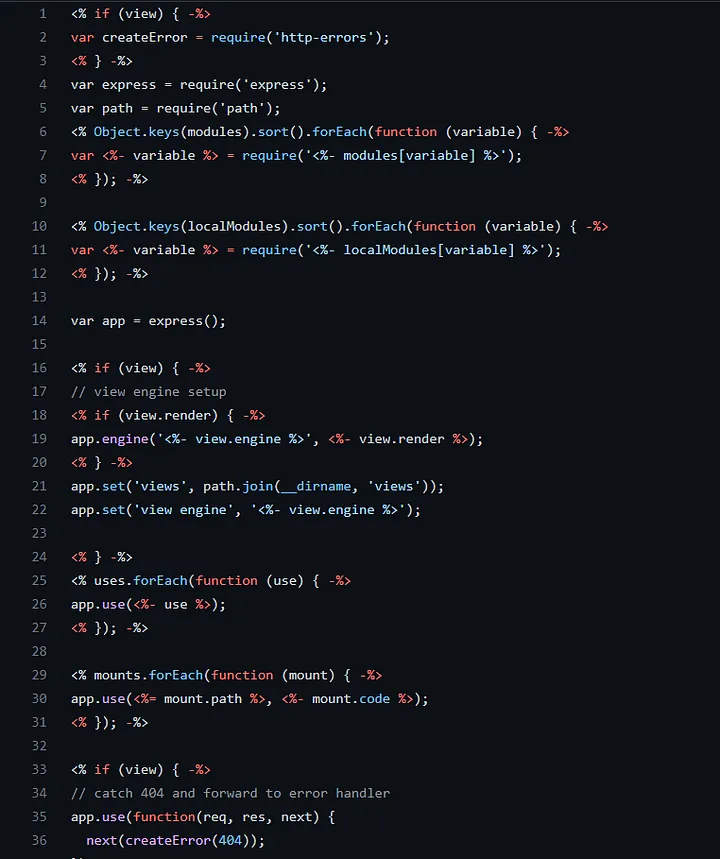
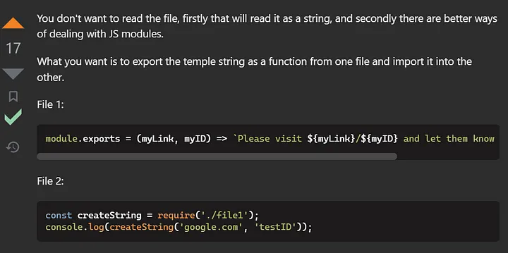
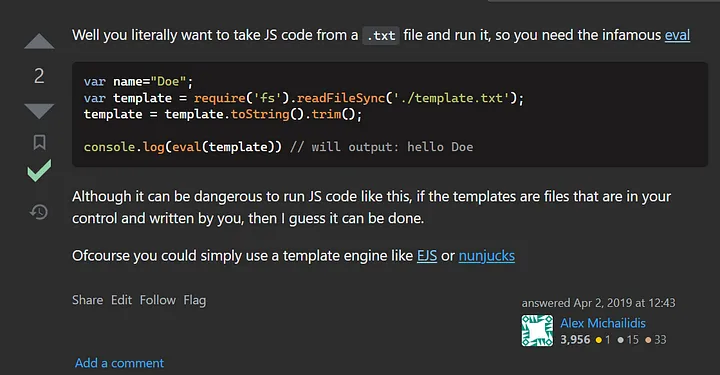

*Olá Senhor! (DALLE-2)*

Na minha jornada de desenvolvimento, sempre “cliquei” no botão da preguiça. Preguiça é o caminho assim como o [Dudeísmo](https://en.wikipedia.org/wiki/Dudeism) é. Seguir o fluxo e ter calma até que seu chefe esteja gritando com você sobre o maldito **prazo**.

Instantaneamente, você acorda e corre para fazer as coisas que você já deveria ter feito. Você está atrasado e seu botão de pânico começa a apitar. “O novo projeto”, eles disseram. Em uma tentativa de dar a si mesmo um pouco de esperança, você balança a cabeça olha para o relógio e pensa: “Eu estou fod*do”.

Não tenho medo meu camarada. Aqui na Companhia do Caos LTDA, nós te damos cobertura.

Apresento-lhe a versão curta deste tutorial **(tl;dr**):
[https://www.npmjs.com/pacote/express-sire](https://www.npmjs.com/package/express-sire)

Acesse o site, use a ferramenta e acelere o esqueleto de seus projetos Node.js. Deixe comentários e hate na [página do GitHub](https://github.com/iwaduarte/express-sire) (ou não, seja seu próprio mestre MUAHAHAHA).

### A longa história também se chama:

# O Feiticeiro, o Revolucionário e O Desenhista

Quando eu era um bebé...zoeira.

O ano é 2009 e um companheiro chamado [Ryan](https://en.wikipedia.org/wiki/Ryan_Dahl) está farto de como o JavaScript está sendo tratado. Muitos valentões de seus castelos de OOP, jogando pedras e dizendo: “Desenvolvedores Java? — Script, por favor”. “Escória”. “Merecem morrer”

Eles entoam suas frases em todos os cantos com orgulho. Não mais. Um mágico no Google está criando uma engine poderosa. Em um futuro distante, essa engine batizará nome de carros.

Ryan é jovem e ingênuo e pensa o tempo todo sobre revoluções. Ele odeia complexidade e configurações desnecessárias. Ele ouve que o mago Lars Bak e seus mosqueteiros estão disponibilizando a poção da engine.

Rapidamente, ele pega os papéis da engine e começa a desenvolver sua revolução. Com o tempo e para sua surpresa, milhões se juntarão à sua causa e ele será responsável pela criação de um enorme batalhão. O batalhão de Node. O fodástico Node.js. Por muitos historiadores o maior batalhão de todos os tempos.

Em uma taverna, algumas horas dali um novo designer das artes negras terá seu momento de fama. Ele se juntará ao exército de Ryan e ajudará essa cruzada ingênua, ele será responsável por uma boa parte das vitórias e da fama deste batalhão.

Seu nome: 
TJ Holowaychuk. (pausa aqui, eu tenho que pesquisar todas as vezes para acertar esse nome).

> Eles mataram, amaldiçoaram e deixaram seu batalhão depois, mas esse não é o ponto...

O Node é a runtime que representa tudo. E isso é tudo que importa por enquanto... *(Deno e Bun estão assistindo)*

# De volta ao TJ

TJ criou milhares de pacotes *(um “pequeno” exagero para aumentar a narrativa)*, coisas como [express](https://expressjs.com/).js, [commander](https://tj.github.io/commander.js/).js, [stylus](https://stylus-lang.com/), [koa](https://koajs.com/) e assim por diante.

O cara era tão prolífico que as pessoas questionavam se ele não era uma equipe em vez de uma pessoa. Ele começou como designer de nível novato para se tornar um desenvolvedor único.

> Essa é a prova viva de que, com dedicação, você pode alcançar tudo. (Mentira, não consegue. Mas vamos dar uma vibe esperançosa a esse texto).

Nosso companheiro criou o nosso amado [express-generator](https://expressjs.com/en/starter/generator.html) também. O que é que faz? 
*(Viu? Eu disse que você não pode alcançar tudo).* Ele gera um **servidor web** com o framework express. Um servidor fácil e simples criado rapidamente.

O express-generator gera arquivos para você. Gera um servidor web para você. Ele gera todo o código para que você não tenha que digitar e criar arquivos e configurar tudo do zero.

A partir daqui você pode pensar sobre a lógica. O negócio. O código. Ao invés de configurar as coisas. É simples o suficiente que não vai forçá-lo a escrever de uma certa maneira ou te forçar uma documentação gigantesca para que você possa aprender a gerar o “caminho certo”. (Critica intencional)

É bom porque o `express` é bom e simples. Então express-generator gera mais do simples. É bom para iniciantes e bom para desenvolvedores experientes também.

### O que aconteceu então? Por que você criou o express-sire?

Eu queria usar um [scaffold](https://en.wikipedia.org/wiki/Scaffold_(programming)) para aumentar minha produtividade. Eu quero ser rápido e preguiçoso ao mesmo tempo. Ter configurações feitas para mim que eu sei que será a mesma pela milésima vez.

Eu olhei para as soluções lá fora. Como um verdadeiro desenvolvedor JavaScript, eu não gostei. Não. Não são piores do que a minha. Elas são provavelmente muito mais complexas do que o que eu fiz e é por isso que eu gosto do que eu fiz ainda mais.

Eu olhei para [o yeoman](https://yeoman.io/) e os projetos de express e nada atendeu meus critérios, que são:

* Ser simples.

* Atualizado.

* Simples

* Estúpido

* Eu disse simples?

* Funcionar como um bloco de lego também é um requerimento.

Você escolhe o que quer ser instalado. Se você quiser assim, tudo bem. Se quiser de outra forma, tudo bem também. Quero isso com aquilo e aquilo. Sem problemas. E essa é toda a ideia. Te fornecer um “gerador de botões que te permite escolher que tipo de ingredientes deliciosos você quer”

E simples e estúpido o suficiente assim como o express-generator. Com isso, eu fui lá ver como o código é feito. E mano... fica interessante...

# Os passos na construção

A questão com generator é que está ficando velho. E código fica velho. Vira legado. Porque não foi tão bem sucedido como deveria 9.**000 downloads semanais** contra **21.000.000** (**express**), não aderiu às práticas atuais.

*Ele ainda usa templates e SSR antigo*. Em uma era de SPA, SSG, SSR moderno e micro-frontends a maneira antiga com templates não é mais tão usada.

*Ainda usa o CJS ([CommonJS](https://en.wikipedia.org/wiki/CommonJS))*. Node e os pacotes estão se movendo para [ESM](https://en.wikipedia.org/wiki/Embedded_System_Module). É um processo complicado e doloroso, mas ainda assim, está vindo e nada pode impedir. A linguagem JavaScript está evoluindo (para melhor ou para pior) e novas práticas estão sendo adotadas a cada ano.

*Não oferece o bloco de lego*. É minimalista e eu amo essa ferramenta. Mas eu sou ganancioso e preguiçoso e quero que tudo seja feito por um computador para que eu possa obter o crédito.

Então, com tudo isso, eu criei uma versão mutante dessa ferramenta.

Eu queria criar da mesma forma que o express-generator fez. Ele cria templates delegando algumas “opções” para uma templating engine, neste caso **EJS.**

> **EJS** é uma linguagem simples de templates que permite gerar HTML com JavaScript. ([**fonte**](https://ejs.co/))

Um arquivo de template (app.js.ejs) dentro do módulo do express-generator é assim:

Embora o EJS seja usado para gerar arquivos HTML, a estratégia aqui é usar o mesmo formato de template, mas para construir um arquivo .js. Uma solução elegante e excelente na época. Hoje em dia, desnecessária.

EJS usa um método `render`para renderizar e analisar e tudo mais e é uma grande biblioteca. Ele usa um monte de [regex](https://github.com/mde/ejs/blob/main/lib/utils.js) e funções e if e else e é uma maneira “complicada” de criar arquivos. Especialmente em um mundo de [template literals](https://developer.mozilla.org/en-US/docs/Web/JavaScript/Reference/Template_literals).

> Nota: Não estou dizendo que o EJS é ruim. Longe disso. Estou dizendo que, para nossa tarefa, é demais.

Não precisariamos de nada acima. O recurso do JavaScript entregaria a mensagem. A ideia é criar um arquivo através dessa feitiçaria poderosa (template literals) e outros também tiveram o mesmo conceito ([aqui](https://github.com/postmanlabs/postman-code-generators/issues/516), [aqui e](https://www.npmjs.com/package/graphql-tag) [aqui](https://www.npmjs.com/package/@ahmadnassri/template-literals-engine)).

Com template literals sendo a escolha, precisamos definir como seria a melhor maneira de “parsear” o template em um objeto JavaScript. Algumas estratégias foram pensadas.

Primeira ideia. “Requiring” o arquivo:

Segunda abordagem. Combinando o template com regex:

Terceira e última. Usando o eval:

Você pode tentar adivinhar aqui. Eu escolhi eval. “Você disse eval?” - Sim. Eval. “Mas... mas... eval é E-V-I-L (mal)”. Meu camarada, evite generalizações e leia a resposta acima.

Deixe me frisar para você:

>> Embora possa ser perigoso executar código JS como este, se os templates são arquivos que estão sob seu controle e escritos por você. Acho que pode ser feito.

E foi assim que eu fiz. Além disso, encontrei uma explicação incrível de Safia Abdalla. Ela escreveu um texto curto e interessante, sobre como template literals funcionam por trás das cortinas. Eu não vou dar spoiler aqui porque é uma leitura fácil e informativa.

[https://dev.to/captainsafia/how-do-template-literals-in-javascript-work-under-the-hood-4g2b](https://dev.to/captainsafia/how-do-template-literals-in-javascript-work-under-the-hood-4g2b) (Inglês)

Certo. Templates gerados. O que mais?

Precisamos fornecer aos usuários uma interface para que eles possam instalar ou fornecer comandos dentro de um terminal. Para isso, tentei manter a quantidade mínima possível de dependências sem ter que reinventar a roda. É sempre a mesma abordagem: menos trabalho e simplicidade produzindo grandes resultados.

Eu tenho visto alguns tutoriais na internet e li a codebase do express-generator.

[https://www.twilio.com/blog/how-to-build-a-cli-with-node-js](https://www.twilio.com/blog/how-to-build-a-cli-with-node-js)

[https://medium.com/henriquekuwai/criando-sua-cli-com-node-js-d6dee7d03110](https://medium.com/henriquekuwai/criando-sua-cli-com-node-js-d6dee7d03110) (português)

[https://www.sitepoint.com/javascript-command-interface-cli-node-js/](https://www.sitepoint.com/javascript-command-line-interface-cli-node-js/)

Eu não segui este tutoriais ao pé da letra, mas peguei ideia de como funciona e o que funcionaria para mim.

Eu trabalhei com essas lindas bibliotecas (como você pode ver no [package.json](https://github.com/iwaduarte/express-sire/blob/master/package.json))

* [Chalk:](https://github.com/chalk/chalk#readme) para ter cores bonitas.

* [Inquirer:](https://github.com/SBoudrias/Inquirer.js/#documentation) para fazer perguntas ao usuário.

* [Figlet:](https://github.com/patorjk/figlet.js) para ter um letreiro em ASCII maneiro.

* [Minimist](https://www.npmjs.com/package/minimist) : para ler os argumentos de entrada do terminal.

Eu também tentei manter o pacote tão baixo em novos recursos JavaScript que os usuários do Node da versão 10 poderiam adotá-lo e usá-lo, mas isso não funcionou como esperado e eu tive que reverter para suportar Node v12.

O pacote também instala coisas que eu acho que são completamente necessárias, mas completamente opcionais, como:

* Módulos ESM ou CJS

* Git (em inglês)

* [Compression](https://github.com/expressjs/compression)

* [Helmet](https://github.com/helmetjs/helmet)

* [Sequelize](https://sequelize.org/docs/v6/)

Eu tomei algumas decisões relacionadas à adição [de Prettier](https://prettier.io/) como uma instalação padrão. Porque me incomoda que as pessoas ainda estejam discutindo sobre coisas que eu acho que são [triviais](https://en.wikipedia.org/wiki/Law_of_triviality) e a formatação de código é uma delas.

Tirando todas as decisões acho que esse é um ótimo projeto e tem muitos caminhos para crescer. Posso (e vou) implementar mais recursos opcionais para que o usuário tenha tudo o que precisar até o almoço quando o chefe estiver gritando na porta e 15 minutos depois estiver sorrindo com um projeto construído para a admiração do público.

Viu? Eu te disse que te davamos cobertura. Não tema companheiro. Estamos aqui um para o outro.

Sucesso!

Mais leitura (links externos):

[Eficiente e reutilizáveis: aplicações de templates e scaffolding](https://medium.com/blue-harvest-tech-blog/refining-efficient-approaches-to-build-reusable-templates-and-a-scaffold-for-the-application-f1459edc3f74) (Inglês)
[Inicie novos projetos mais Rápido: 10 Ferramentas de Scaffolding para desenvolvimento web](https://www.sitepoint.com/start-new-projects-faster/) (Inglês)

