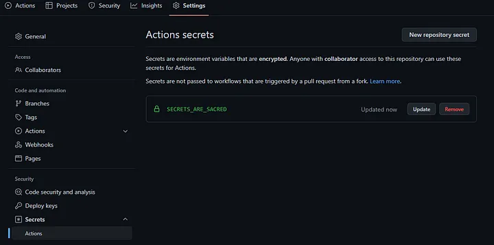
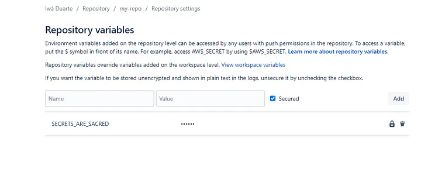

De vez em quando alguém vai criar novas palavras: DevOps, GitOps, \*.(\*.)Ops, CI/CD, deployment de pods multifator orquestrados em contêineres virtuais (acho que inventei esse).

O fato é que todo desenvolvedor/equipe/empresa deseja atingir um simples objetivo . Ter os seus arquivos/produtos/”tecnologia disruptiva” para o público ver. Mas nem sempre é bonito.

# Qual é a melhor maneira de fazer isso?

Deixe-me vestir minha armadura, meu amigo, vou começar a fugir da guerra de melhores práticas antes de mergulharmos nesse tópico.

*Esse sou eu, fugindo da guerra das melhores práticas em minha nova armadura brilhante. (DALLE-2)*

As pessoas estão acostumadas a misturar as coisas que sabem com o termo *melhores práticas*. Elas aprendem algo através do suor e das lágrimas e se apegam a isso. Elas se apegam mesmo que haja uma tecnologia melhor ou uma melhor maneira de fazer. Elas se apegam porque “funciona”. Elas se apegam porque são mestres daquele conhecimento.

Está tudo bem. Não há nenhum problema nessa parte. Aprender algo a cada segundo só por aprender é terrível também. Ninguém deveria ser forçado a aprender constantemente. É estressante e pode causar muitas dores de cabeça.

O verdadeiro problema é quando você tenta impor aos outros suas limitações ou pontos de vista como se fossem a “maneira certa de se fazer algo” sem uma razão sólida para fazê-lo e sem ter tentado outras alternativas e suas desvantagens .

Por essa razão, quero que você se afaste de suas construções e crenças e tenha paciência comigo por um segundo. Se você não gostar da minha sugestão, você pode sempre voltar e ler novamente (hahaha) ou manter sua posição sobre o assunto.

Especificamente, em termos de **deployment**, minha opinião é que você deve almejar **simplicidade** e **autonomia**.

# Explicando a maneira como os códigos são deployados da forma mais direta possível.

*(Você desenvolvedor experiente, pode pular essa parte)*

Atualmente, temos diferentes formas de fazermos o deployment do código, mas geralmente funciona dessa maneira:

Alguém cria um código em sua linguagem de programação preferida seja ao criar um novo recurso, editando uma funcionalidade existente ou removendo algo. Depois disso, eles salvam o que fizeram, e hoje em dia usa-se o [Git](https://en.wikipedia.org/wiki/Git) (VCS).

Depois de **commitar** a mudança, eles geralmente (**push**) **enviam** seus arquivos para um específico provedor de sistema de controle de versões (VCS) que armazena o código para contribuição/compartilhamento de equipe. Podemos citar alguns:
[GitLab](https://about.gitlab.com/), [GitHub](https://github.com/), [Bitbucket](https://bitbucket.org/product).

Lá eles geralmente **revisam (review)** o código e criticam as coisas que não gostam. Por meio de comentários amigáveis ou tóxicos, discussões sem disputas ou de toma-lá-dá-cá, eles chegam a um acordo e o código pode seguir em frente.

Uma vez que o código é aprovado, ele finalmente chega à parte para a qual este tutorial foi criado.

O código é deployado e através de um arquivo **YAML** específico. Ele contém um conjunto de **regras** e geralmente o seu objetivo é de conectar-se a um ***serviço de nuvem*** específico, definir ***variáveis de ambiente*** arbitrárias e enviar o **código** para esses serviços.

É para isso que serve o **YAML**. Enviar dados com segurança para um serviço de nuvem específico ( [AWS](https://aws.amazon.com/), [Google Cloud](https://cloud.google.com/), [Azure](https://azure.microsoft.com/en-us/)). Eles chamam todo o processo de CI/CD, deployment, etc etc etc. (*Ei hater, eu sei que não são iguais, mas meio que são*)

*O hater olhando para mim e balançando a cabeça (DALLE-2)*

Se pudessemos estabelecer os passos desses arquivos YAML, seria algo assim:

1. Para conectar e enviar dados para o serviço de nuvem.

1. *Às vezes* para fazer alguns testes e verificar algumas regras de linting

1. Para criar a imagem do container (como o container leia-se um arquivo com as diretivas do que este *“mini-computador”* deve ter instalado e suas configurações) ou bundle ou alguma coisa que precisa ser transformada.

1. Para configurar as variáveis de ambiente.

Esses 4 passos não são obrigatórios e a lista não é exaustiva, eles podem aparecer isolados ou em conjunto com os demais. Ao olhar esses passos, você poderia pensar: “Isso deverá ser um trabalho simples”

E, no entanto, as pessoas conseguem tornar esse arquivo **YAML** ainda mais complexo do que o necessário.

# The problem with too complex configuration files

Deixe me mostrar alguns examples, eu mostrarei alguns arquivos que são muito complexos e alguns que são simples o suficiente.

### Me mostra logo a porcaria do CÓDIGO!

*Desculpe. É meu segundo post, estou buscando qualidade. :P*

O código abaixo é daqueles complexos que podem ser simplificados. *(É traiçoeiro porque **aparenta** ser simples.)*

```
image: someimage
pipelines:
  branches:
    master:
      - step:
          name: Deploy to Prod 
          #deployment: production
          script:
            - export AWS_ROLE="XXXXXXXXXXXXXXXX"
            - export AWS_ACCOUNT_NAME="XXXXXXXXXXXXXXXXXX"
            - export AWS_ACCOUNT_ID="XXXXXXXXXXXXXXXXXXXX"
            - export ENV="prod"
            - export timeStamp=$(date +%s)
            - export DBHOST=YYYYYYYYYYYYYYYYYYYYYYYYYYYYYYYYYY
            - export LAMBDA_FN=YYYYYYYYYYYYYY
            - make deploy
```

Eu sei que você provavelmente está se perguntando. Qual é o problema com esse código e o que ele faz?

**Faça você mesmo esta pergunta**. O que essa configuração pretende fazer? Lembre-se meu jovem Padawan, “enviar algum código para algum lugar”.

Você poderia apenas com esse arquivo ver exatamente o que está acontecendo aqui? Ver para onde o código está indo? Ver qual serviço está sendo chamado? Deixe-me estragar para você,** não, você não pode**. Eles estão usando [MAKE](https://www.gnu.org/software/make/), [MAKE](https://www.gnu.org/software/make/) caral** e isso é insano!

Vou mostrar parcialmente o que o comando: make deploy está fazendo

```
ifdef DOTENV
   DOTENV_TARGET=dotenv
else
   DOTENV_TARGET=.env
endif

ifdef AWS_ROLE
  ASSUME_REQUIRED?=assumeRole
endif

################

deploy: $(ENV_RM_REQUIRED) $(DOTENV_TARGET) $(ASSUME_REQUIRED)
   docker-compose run --rm serverless make _deps _buildLayer _deploy

# Create .env based on .env.template if .env does not exist
.env: XXXXXXXX

# Create/Overwrite .env with $(DOTENV)
dotenv: YYYYYYYYYYYY

_deps:
   echo "//registry.npmjs.org/:_authToken=$(NPM_TOKEN)" >> .npmrc
   yarn config set registry http://registry.npmjs.org
   yarn install --no-bin-links

_buildLayer:
   mkdir -p folder
   mv database folder
   mv node_modules folder
   echo 'folder'
   ls ./folder

_deploy:
   sls deploy --force -v
```

Você poderia adivinhar o que eles estão tentando fazer agora? Eu vou facilitar para você.

1 — Criar variáveis de ambiente

2 — Definir um *registry* para o uso de pacote privado

3 — Deploy usando o serverless framework (**sls deploy**)

4 — Configurando tudo isso por meio de um contêiner docker

Serverless aqui é outra fera e foge do escopo deste tutorial. O que eu quero mostrar é que eles usaram MAKE para criar as mesmas coisas que você poderia conseguir apenas com o arquivo YAML.

### Mas por que eles fizeram isso?

A lógica por trás disso é evitar o [**vendor locking**](https://pt.wikipedia.org/wiki/Aprisionamento_tecnol%C3%B3gico)** e estar pronto para mudanças ([**agnostic-ready**](https://en.wikipedia.org/wiki/Agnostic_(data))). Se eles quiserem migrar do **Bitbucket** para o **GitLab** para o **GitWhatever**, eles farão isso e o código permaneceria praticamente o mesmo.

Esses tipos de raciocínio são, na minha opinião, excessivamente zelosos. Eles mostram o lado do seu ego mais do que qualquer outra coisa. Sim, você sabe como criar pipelines de alto desempenho com MAKE, você conhece seus paranauês. Você é competente. Mas ainda assim, você não alcança a simplificação. A abordagem leiga que todo mundo está pedindo.

Eles também estão muito preocupados com vendor locking. De uma forma ou de outra, você estará preso (“vendor-locked”) em alguma coisa. Não importa. Ou AWS ou Azure, GitLab ou Git, Java ou Node.js. Portanto, tentar prever o futuro não é uma grande estratégia na minha opinião.

>> Vale a pena notar que, embora as linguagens de programação não sejam fornecedores (vendors), se você pensar, indiretamente eles são. Eles são a primeira decisão arquitetônica que baseará todas as suas escolhas posteriores..

A abordagem agnóstica ou de bala de prata que se preocupa com a mudança de linhas de código no futuro também não é eficaz. Quantas vezes você mudou sua arquitetura bem planejada? Se tudo correr bem e você não estiver enfrentando alguns problemas significativos de custo/desempenho/erros, você provavelmente está dando a esse sistema um **selo** de *sistema legado no futuro.*

Mudar e quebrar coisas são partes cruciais de qualquer ciclo humano. Não se preocupe muito cedo. Espere até o problema existir… Capisci?

### Como eu simplificaria tudo isso?

```
image: someimage
pipelines:
  branches:
    master:
      - step:
          name: Deploy to Prod 
          #deployment: production
          script:
            - export AWS_ROLE="XXXXXXXXXXXXXXXX"
            - export AWS_ACCOUNT_NAME="XXXXXXXXXXXXXXXXXX"
            - export AWS_ACCOUNT_ID="XXXXXXXXXXXXXXXXXXXX"
            - export ENV="prod"
            - export timeStamp=$(date +%s)
            - export DBHOST=YYYYYYYYYYYYYYYYYYYYYYYYYYYYYYYYYY
            - export LAMBDA_FN=YYYYYYYYYYYYYY
            - npm install
            - npm install serverless -g
            - sls deploy --force -v
```

Agora você pode olhar para esse arquivo e ver exatamente o que ele vai fazer. Você não precisará mais percorrer milhares de arquivos para ter a ideia do que está acontecendo.
Nessa forma é mais **fácil**, é mais **simples** e é **direto ao ponto**.

E com isso vem a primeira sugestão. **Tente** **diminuir o número de arquivos por aí**. No caso de você ter 100.000 linhas de arquivo YAML. OK. Você merece uma organização melhor, mas em vez de se organizar primeiro assumindo que sua configuração crescerá, abrace o caos e deixe-se levar por um tempo. Você pode me agradecer depois.

# O problema com variáveis de ambiente

### Onde colocar minhas variáveis .env?

> Em primeiro lugar, o que são variáveis de ambiente ? Você pode conferir este artigo [https://www.freecodecamp.org/news/what-are-environment-variables-and-how-can-i-use-them-with-gatsby-and-netlify/](https://www.freecodecamp.org/news/what-are-environment-variables-and-how-can-i-use-them-with-gatsby-and-netlify/) (você pode pular a parte do gatsby e da netlify)

Outro problema atual está relacionado a onde armazenar as variáveis de ambiente. As pessoas gastam muito tempo discutindo sobre onde deveria ser o lugar mais seguro e acabam tomando a decisão mais estúpida de todas.

Já vi empresas armazenarem suas variáveis de ambiente em um banco de dados. Sério. Em um **BANCO-de-DADOS**, em uma **TABELA**, **sem nenhuma proteção**, e continha cada token/PWD/usuário para cada serviço usado dentro da aplicação. Por favor não faça isso. Não há lógica por trás disso, às vezes as pessoas não tem conhecimento nenhum.

O lugar mais comum é usar um arquivo **.env.** Isso já levou a problemas como pessoas que comitaram suas credenciais em [repositórios públicos](https://www.ndss-symposium.org/wp-content/uploads/2019/02/ndss2019_04B-3_Meli_paper.pdf).

Outra maneira é armazenar as credenciais em **um gerenciador de segredos (secrets manager)** na nuvem.
A partir daí, seu aplicativo solicitaria a credencial de forma assíncrona quando necessário. Para isso você precisaria usar o SDK do serviço. Aqui vai um exemplo simples.

https://stackoverflow.com/questions/57618689/how-do-i-use-aws-secret-manager-with-nodejs-lambda/57618800#57618800

Para mais informação, você ver: [usando AWS SSM](https://docs.aws.amazon.com/pt_br/systems-manager/latest/userguide/systems-manager-parameter-store.html)

Ambas as soluções são boas. Se você configurou suas variáveis de ambiente de forma correta, eles são um excelente candidato. A maneira mais simples, fácil e preguiçosa que eu posso pensar é combinar arquivos **.env** e o recurso de um provedor sistema de controle de versão (GitHub, Bitbucket) que permite salvar as *senhas* criptografadas para serem usados na fase de deployment.

GitHub chama o recurso de **Action secrets**, Bitbucket de **Repository variables**. Se feito corretamente será suficiente para 90% dos casos.

Para o GitHub, esse é o link:
[https://github.com/your-username/your-repository/settings/secrets/actions](https://github.com/iwaduarte/my-finances/settings/secrets/actions)

*Você pode ver que as variáveis de ambiente são criptografadas conforme descrito na imagem. (configurações do GitHub)*

Para o Bitbucket:
[https://bitbucket.org/your-username/your-repo/admin/addon/admin/pipelines/repository-variables](https://bitbucket.org/iwaduarte/my-repo/admin/addon/admin/pipelines/repository-variables)



E então você configuraria seu arquivo da seguinte forma::

**Bitbucket YAML:**

```
pipelines:
  branches:
    master:
      - step:
          name: Test and deploy to dev
          image: node:16
          caches:
            - node
          deployment: test
          script:
            - npm install
            - npm install serverless -g
             - serverless config credentials --provider aws --key $AWS_KEY --secret $AWS_SECRET
            - touch .env
            - echo "DB_NAME=$DB_NAME" >> .env
            - echo "DB_USER=$DB_USER" >> .env
            - echo "DB_DIALECT=$DB_DIALECT" >> .env
            - echo "DB_PASS=$DEV_DB_PASS" >> .env
            - echo "DB_HOST=$DEV_DB_HOST" >> .env
            - serverless deploy
          artifacts:
            - dist/**
```

*Passo-a-passo explicado:*

1 — As variáveis $AWS_KEY e $AWS_SECRET são definidas na seção de **repository variables** (como explicado acima) e são importantes para o serverless framework.

2 —Em seguida, criamos um arquivo .env com o comando **.*touch env*** e começamos a popular variáveis neste arquivo (ex. “DB_NAME=$DB_NAME” >> .env )

3 — Este arquivo .env será enviado com outros arquivos para o destino selecionado (nesse caso, eles enviarão variáveis de ambiente para o [AWS lambda](https://aws.amazon.com/lambda/))

**GitHub YAML:**

```
name: Deploy to Fargate
on:
  push:
    branches:
      - master
jobs:
  deploy:
    name: Deploy Node to ECS Fargate
    runs-on: ubuntu-latest
    strategy:
      matrix:
        node-version: [16.x]
    steps:
      - uses: actions/checkout@v2
      - uses: actions/setup-node@v2-beta
        with:
          node-version: '16'
      - name: Install dependencies
        run: npm install
      - name: Set env variables
        run: |
          touch .env
          echo "NODE_ENV=stage" >> $GITHUB_ENV
          echo "SERVICE_NAME=${{ secrets.SERVICE_NAME_PROD }}" >> $GITHUB_ENV
          echo "AWS_ACCESS_KEY=${{ secrets.AWS_ACCESS_KEY_ID}}" >> .env
          echo "AWS_SECRET_ACCESS=${{ secrets.AWS_SECRET_ACCESS_KEY}}" >> .env
          echo "DATABASE=${{ secrets.DATABASE}}" >> .env
          echo "DATABASE_HOST=${{ secrets.DATABASE_HOST}}" >> .env
          echo "DATABASE_USER=${{ secrets.DATABASE_USER}}" >> .env
          echo "DATABASE_PASSWORD=${{ secrets.DATABASE_PASSWORD}}" >> .env

      - name: Configure AWS credentials
        uses: aws-actions/configure-aws-credentials@v1
        with:
          aws-access-key-id: ${{ secrets.AWS_ACCESS_KEY }}
          aws-secret-access-key: ${{ secrets.AWS_SECRET_ACCESS_KEY}}
          aws-region: ${{ secrets.AWS_REGION_ECS }}
      - name: Login to Amazon ECR
        id: login-ecr
        uses: aws-actions/amazon-ecr-login@v1

      - name: Build, tag, and push image to Amazon ECR
        id: build-image
        env:
          ECR_REGISTRY: ${{ steps.login-ecr.outputs.registry }}
          ECR_REPOSITORY: ${{ secrets.ECR_REPOSITORY }}
          IMAGE_TAG: ${{ env.NODE_ENV }}-latest
        run: |
          # Build a docker container and
          # push it to ECR so that it can
          # be deployed to ECS.
          docker build -t $ECR_REGISTRY/$ECR_REPOSITORY:$IMAGE_TAG .
          docker push $ECR_REGISTRY/$ECR_REPOSITORY:$IMAGE_TAG
          echo "::set-output name=image::$ECR_REGISTRY/$ECR_REPOSITORY:$IMAGE_TAG"

      - name: Fill in the new image ID in the Amazon ECS task definition
        id: task-def
        uses: aws-actions/amazon-ecs-render-task-definition@v1
        with:
          task-definition: ecs-task-definition-${{ env.NODE_ENV }}.json
          container-name: container-name
          image: ${{ steps.build-image.outputs.image }}

      - name: Deploy Amazon ECS task definition
        uses: aws-actions/amazon-ecs-deploy-task-definition@v1
        with:
          task-definition: ${{ steps.task-def.outputs.task-definition }}
          service: ${{ env.SERVICE_NAME }}
          cluster: ${{ secrets.ECS_CLUSTER_NAME }}
          wait-for-service-stability: true

      - name: Configure AWS credentials
        uses: aws-actions/configure-aws-credentials@v1
        with:
          aws-access-key-id: ${{ secrets.AWS_ACCESS_KEY }}
          aws-secret-access-key: ${{ secrets.AWS_SECRET_ACCESS }}
          aws-region: ${{ secrets.AWS_REGION }}
```

*Passo-a-passo explicado:*

1 — Este é um exemplo um pouco mais complicado. Ele envia dados para um serviço chamado [Fargate](https://aws.amazon.com/fargate/getting-started/?nc=sn&loc=3) por meio de uma série de **GitHub actions** de outros repositórios (oficial da AWS)

2 —Ele precisa das variáveis de ambiente que foram definidas no **Action secret**s (acima). 

3 — Ele cria o arquivo .env que será salvo dentro dessa imagem que será executada no Fargate

4 —Perceba que não somente usa as variáveis de ambiente para criar o arquivo .env, mas também para se conectar aos serviços da AWS.

Esse é um arquivo YAML bem mais complexo com vários passos e configurações e ainda assim ele usa apenas um arquivo. Se você ler com atenção pode ver o que vai fazer, ele usa o serviço de secrets do GitHub e envia o código para o Fargate.

**Direto e até tedioso.** E se você conhecer um pouco de configuração YAML você diria: “**simples** de seguir”. Entretanto, se você não sabe o que é todo esse jargão, não tenha medo.

Eles forneceram uma bela documentação:

[**GitHub — Understanding GitHub actions](https://docs.github.com/en/actions/learn-github-actions/understanding-github-actions)
[BitBucket — Configure bitbucket-pipelines.yml (same as YAML)](https://support.atlassian.com/bitbucket-cloud/docs/configure-bitbucket-pipelinesyml/)**

Na última parte deste tutorial, vamos discutir quando você tem branches diferentes e códigos similares.

# O problema ao ter branches diferentes e código de comportamento similar

### Executar actions em branches especificos

Para o BitBucket os branches fazem parte da configuração, então você pode definir a branch específica e a configuração será executada exclusivamente. Esse recurso **é muito importante (parabéns à equipe da Atlassian)** porque você pode ter um banch de desenvolviment (development) e produção (production) separados no mesmo arquivo de configuração. Algo como:

```
pipelines:
  default:
    - step:
        name: Build and test
        script:
          - npm install
          - npm test
  branches:
    master:
    - step:
          name: deploy  to PRODUCTION
          image: node:16
          caches:
            - node
          deployment: test
          script:
            - npm install
            - npm install serverless -g
            - serverless config credentials --provider aws --key $AWS_KEY --secret $AWS_SECRET
            - touch .env
            - echo "DB_NAME=$DB_NAME_PROD" >> .env
            - echo "DB_USER=$DB_USER_PROD" >> .env
            - echo "DB_DIALECT=$DB_DIALECT_PROD" >> .env
            - echo "DB_PASS=$DEV_DB_PASS_PROD" >> .env
            - echo "DB_HOST=$DEV_DB_HOST_PROD" >> .env
            - serverless deploy
          artifacts:
            - dist/**
    develop:
      - step:
          name: deploy to DEVELOP
          image: node:16
          caches:
            - node
          deployment: test
          script:
            - npm install
            - npm install serverless -g
            - serverless config credentials --provider aws --key $AWS_KEY --secret $AWS_SECRET
            - touch .env
            - echo "DB_NAME=$DB_NAME_DEV" >> .env
            - echo "DB_USER=$DB_USER_DEV" >> .env
            - echo "DB_DIALECT=$DB_DIALECT_DEV" >> .env
            - echo "DB_PASS=$DEV_DB_PASS_DEV" >> .env
            - echo "DB_HOST=$DEV_DB_HOST_DEV" >> .env
            - serverless deploy
          artifacts:
            - dist/**
```

Nesse caso, se você enviar um aplicativo para a branch master, apenas o master será atualizado e o desenvolvimento será ignorado. Top né?

**E como é com o GitHub?**

Não sei porque é tão diferente. Muitas vezes na minha jornada de desenvolvedor eu não curti como eles fazem as coisas, tudo me pareceu sempre mais complicado. E como você já sabe, eu tenho aversão à esperteza quando traz mais coisas para eu aprender/trabalhar.

Alguns dos tutoriais que li antes de criar o meu (rant) são muito bons, exceto quando se trata de branches:

[https://keithweaverca.medium.com/only-run-github-actions-on-specific-branches-694782fcc07](https://keithweaverca.medium.com/only-run-github-actions-on-specific-branches-694782fcc07)

[https://medium.com/sysf/how-to-set-up-github-workflows-and-create-github-actions-using-docker-3a5ba7ec0988](https://medium.com/sysf/how-to-set-up-github-workflows-and-create-github-actions-using-docker-3a5ba7ec0988)

Eles têm a mesma estratégia. Se você criar uma branch , você cria um arquivo diferente. E o paradigma “novo branch— novo YAML” vai contra o que defendi aqui até agora, lembra-se meu jovem Padawan?

>> “**Tente** **diminuir o número de arquivos por aí.**”

E com isso e a ajuda do melhor lugar para copypasta de código:

https://stackoverflow.com/a/58142412/7350853

Depois de ler acima, você poderá ver a solução. Nós poderemos agora chegar numa versão melhor. Usando if’s. Simples if’s. Bem conhecido por qualquer desenvolvedores que já tocou a superfície de um teclado. Maravilha. Vamo nessa então.

Vamos reutilizar o mesmo arquivo YAML do Fargate:

```
name: Deploy to Fargate
on:
  push:
    branches:
      - master
jobs:
  deploy:
    name: Deploy Node to ECS Fargate
    runs-on: ubuntu-latest
    strategy:
      matrix:
        node-version: [16.x]
    steps:
      - uses: actions/checkout@v2
      - uses: actions/setup-node@v2-beta
        with:
          node-version: '16'
      - name: Install dependencies
        run: npm install

      - name: Set env variables for DEVELOP
      if: github.ref == 'refs/heads/develop'
        run: |
          touch .env
          echo "NODE_ENV=dev" >> $GITHUB_ENV
          echo "SERVICE_NAME=${{ secrets.SERVICE_NAME_DEV }}" >> $GITHUB_ENV
          echo "AWS_ACCESS_KEY=${{ secrets.AWS_ACCESS_KEY_ID}}" >> .env
          echo "AWS_SECRET_ACCESS=${{ secrets.AWS_SECRET_ACCESS_KEY}}" >> .env
          echo "DATABASE=${{ secrets.DATABASE_DEV}}" >> .env
          echo "DATABASE_HOST=${{ secrets.DATABASE_HOST_DEV}}" >> .env
          echo "DATABASE_USER=${{ secrets.DATABASE_USER_DEV}}" >> .env
          echo "DATABASE_PASSWORD=${{ secrets.DATABASE_PASSWORD_DEV}}" >> .env

      - name: Set env variables for PRODUCTION
      if: github.ref == 'refs/heads/master'
        run: |
          touch .env
          echo "NODE_ENV=dev" >> $GITHUB_ENV
          echo "SERVICE_NAME=${{ secrets.SERVICE_NAME_PROD }}" >> $GITHUB_ENV
          echo "AWS_ACCESS_KEY=${{ secrets.AWS_ACCESS_KEY_ID}}" >> .env
          echo "AWS_SECRET_ACCESS=${{ secrets.AWS_SECRET_ACCESS_KEY}}" >> .env
          echo "DATABASE=${{ secrets.DATABASE_DEV}}" >> .env
          echo "DATABASE_HOST=${{ secrets.DATABASE_HOST_PROD}}" >> .env
          echo "DATABASE_USER=${{ secrets.DATABASE_USER_PROD}}" >> .env
          echo "DATABASE_PASSWORD=${{ secrets.DATABASE_PASSWORD_PROD}}" >> .env
      - name: Configure AWS credentials
        uses: aws-actions/configure-aws-credentials@v1
        with:
          aws-access-key-id: ${{ secrets.AWS_ACCESS_KEY }}
          aws-secret-access-key: ${{ secrets.AWS_SECRET_ACCESS_KEY}}
          aws-region: ${{ secrets.AWS_REGION_ECS }}
      - name: Login to Amazon ECR
        id: login-ecr
        uses: aws-actions/amazon-ecr-login@v1

      - name: Build, tag, and push image to Amazon ECR
        id: build-image
        env:
          ECR_REGISTRY: ${{ steps.login-ecr.outputs.registry }}
          ECR_REPOSITORY: ${{ secrets.ECR_REPOSITORY }}
          IMAGE_TAG: ${{ env.NODE_ENV }}-latest
        run: |
          # Build a docker container and
          # push it to ECR so that it can
          # be deployed to ECS.
          docker build -t $ECR_REGISTRY/$ECR_REPOSITORY:$IMAGE_TAG .
          docker push $ECR_REGISTRY/$ECR_REPOSITORY:$IMAGE_TAG
          echo "::set-output name=image::$ECR_REGISTRY/$ECR_REPOSITORY:$IMAGE_TAG"

      - name: Fill in the new image ID in the Amazon ECS task definition
        id: task-def
        uses: aws-actions/amazon-ecs-render-task-definition@v1
        with:
          task-definition: ecs-task-definition-${{ env.NODE_ENV }}.json
          container-name: container-name
          image: ${{ steps.build-image.outputs.image }}

      - name: Deploy Amazon ECS task definition
        uses: aws-actions/amazon-ecs-deploy-task-definition@v1
        with:
          task-definition: ${{ steps.task-def.outputs.task-definition }}
          service: ${{ env.SERVICE_NAME }}
          cluster: ${{ secrets.ECS_CLUSTER_NAME }}
          wait-for-service-stability: true

      - name: Configure AWS credentials
        uses: aws-actions/configure-aws-credentials@v1
        with:
          aws-access-key-id: ${{ secrets.AWS_ACCESS_KEY }}
          aws-secret-access-key: ${{ secrets.AWS_SECRET_ACCESS }}
          aws-region: ${{ secrets.AWS_REGION }}
```

Como você pode facilmente ver, usando cláusula IF ( if: github.ref == ‘branch’ ), nós definimos **Action secrets** para produção e **Action secrets** para desenvolvimento e eles só preencherão o arquivo .env quando a branch especifica for comitada.

Essa é a maneira mais estúpida de todos os tempos e eu estou orgulhoso. É tão simples que você não precisará de MAKE ou milhares de arquivos ou qualquer outra coisa. Apenas um pouco de if’s aqui e ali, algumas variáveis de ambiente definidas e pronto você está sendo tornando um master **Jedi do KISS.**

*KISS (Mantenha as coisas simples, estúpido) (DALLE-2)*

Vale a pena notar também, que eu sei, o mundo está cheio de casos complicados e cenários específicos que precisariam de um certo nivel de complexidade. A maior parte do seu raciocínio defendendo sua ideia pode de fato ser a única e a única solução mesmo. Não vou contestar isso, existem casos complexos que eu como programador do tipo blub nem sequer conceberei na minha limitada percepção/conhecimento.

E tá tudo bem também. Estou mirando naqueles que não têm a menor ideia do que estão fazendo ou não pararam para pensar um pouco se isso traria alegria algumas semanas depois, quando todos esquecerem o que fizeram.

Estou defendendo a simplicidade e a autonomia. Eu poderia ir e mostrar vários outros casos e abordagens problemáticas, mas acho que entreguei a mensagem de como ser o máximo sofisticado.

E agora , **finalmente** , você pode enfrenta-los, meu jovem. Sem nenhuma hesitação ou medo.

*Meu padawan está começando a acreditar. (DALLE-2)*

Boa sorte na sua jornada.


